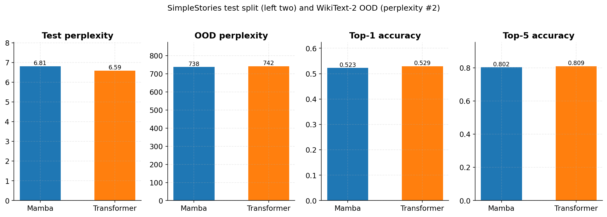
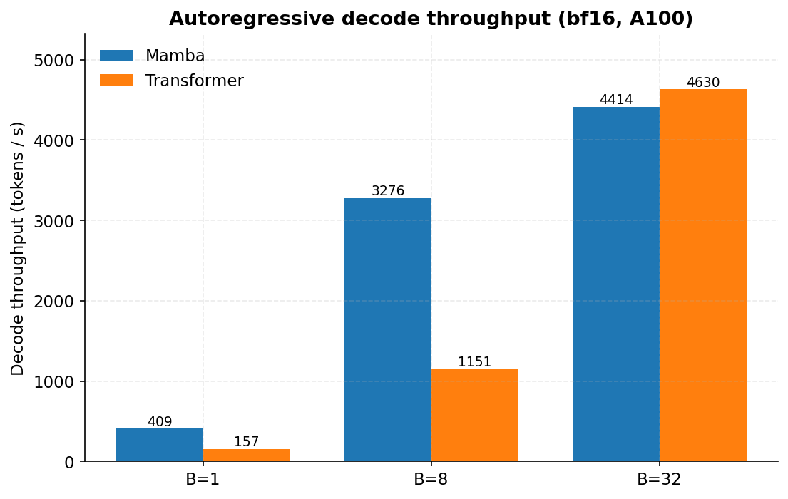
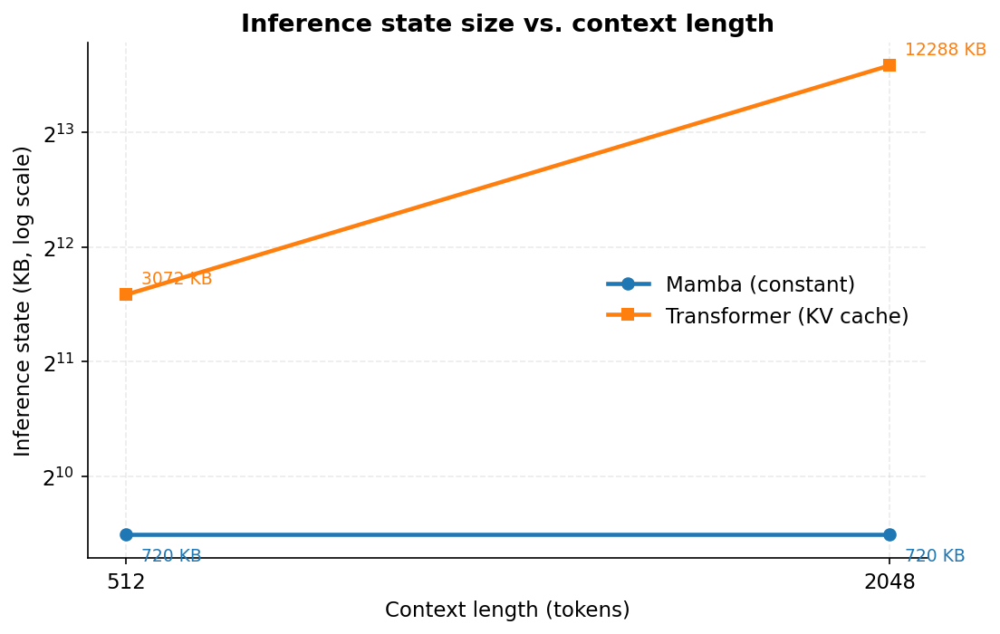
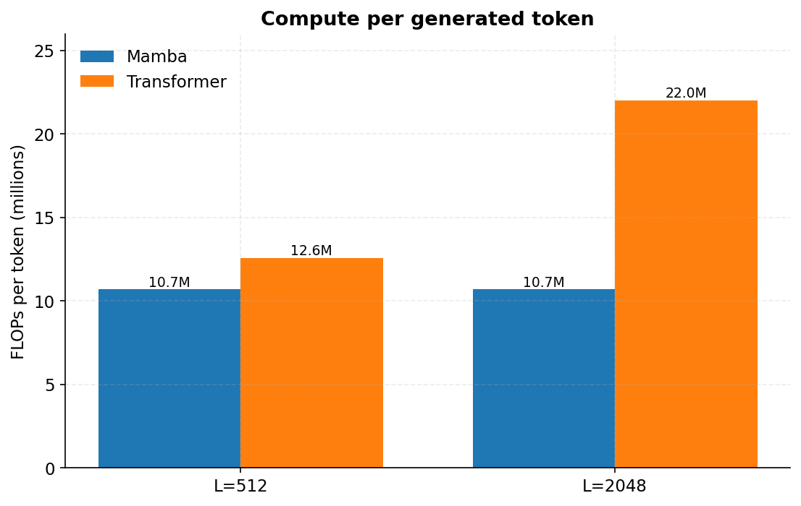
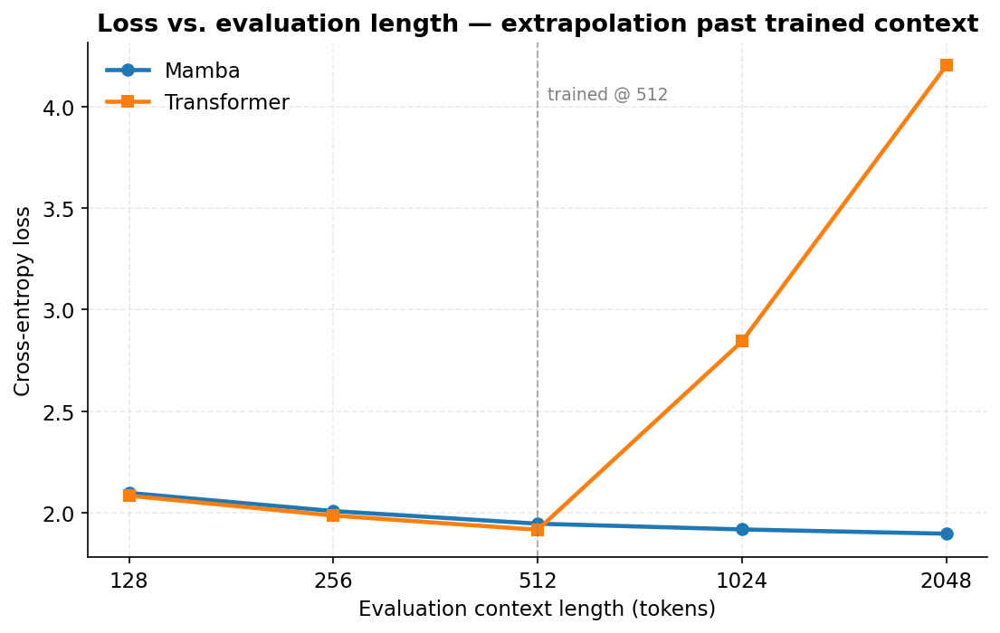
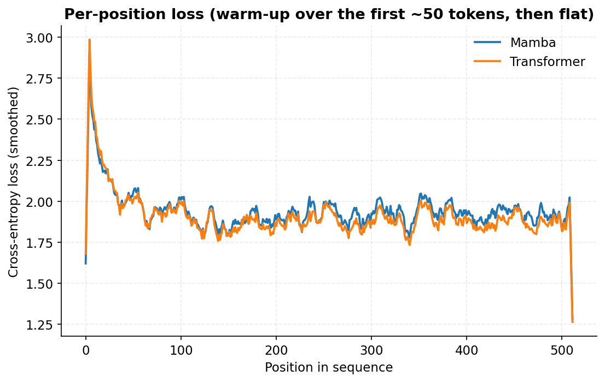
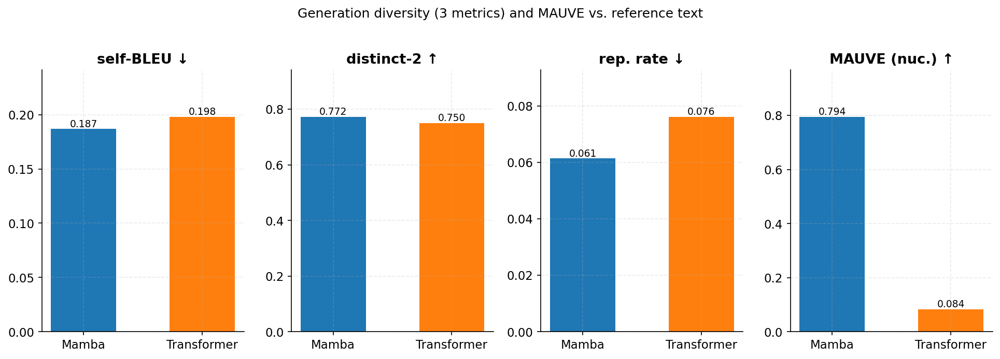

# csci739-project-mamba

Final project for CSCI 739, Topics in Generative AI. Rochester Institute of
Technology, Spring 2026.

## Overview

We pre-train a Mamba state-space language model on the
[SimpleStories](https://huggingface.co/datasets/lennart-finke/SimpleStories)
dataset and compare it to the
[SimpleStories-5M](https://huggingface.co/SimpleStories/SimpleStories-5M)
transformer baseline. The two models share the same tokenizer, the same
training corpus, the same approximate parameter budget (about 5M unique
parameters), and the same evaluation procedure, so the observed differences
should reflect architectural choices rather than training-data or scaling
effects.

The Mamba implementation under `src/mamba/` is adapted from the reference
repository at <https://github.com/state-spaces/mamba>. Two backends are
provided. The CUDA path uses Triton fused-scan kernels in `fused_scan.py`.
The TPU / XLA path uses a pure-tensor parallel scan in `xla_fused_scan.py`.
Checkpoints saved by either path load into the other.

## Results

All figures are produced from `results/simplestories_eval_results_final.json`
by running `python figures/make_figures.py`.

### Test-set quality

The two models reach similar test perplexity, top-1, and top-5 accuracy on
the in-distribution SimpleStories test split. Both score poorly on
WikiText-2, which is well outside the training distribution.



*Figure 1. Perplexity and top-k accuracy. The first column is in-distribution
test perplexity; the second is out-of-distribution perplexity on WikiText-2;
the third and fourth are top-1 and top-5 accuracy on the in-distribution
split.*

### Inference throughput

Figure 2 reports autoregressive decode throughput in tokens per second.
At batch size 1, Mamba decodes about 2.6 times faster than the transformer.
The gap narrows at larger batch sizes because both models become bound on
the dense linear layers rather than the per-step attention computation.



*Figure 2. Decode throughput at batch sizes 1, 8, and 32. Measured in bf16
on a single NVIDIA A100.*

### Inference state and per-token compute

The Mamba hidden state has a fixed size that is independent of context
length. The transformer KV cache grows linearly with context length.
Figure 3 shows the inference state at sequence lengths 512 and 2048: the
Mamba state stays at 720 KB while the transformer cache grows from 3 MB
to 12 MB.



*Figure 3. Inference state size in kilobytes on a log scale.*

Per-token compute follows the same scaling distinction (Figure 4). Mamba's
FLOPs per generated token are constant in sequence length. The
transformer's grow with sequence length because of self-attention.



*Figure 4. FLOPs per generated token at sequence lengths 512 and 2048.*

### Length generalization

Both models were trained at sequence length 512. Figure 5 reports
cross-entropy on held-out text at evaluation lengths 128, 256, 512, 1024,
and 2048. Mamba's loss continues to decrease as evaluation length grows.
The transformer's loss rises sharply past the training length, which is
consistent with absolute-position embeddings that do not extrapolate.



*Figure 5. Cross-entropy as a function of evaluation context length.*

Figure 6 plots cross-entropy as a function of position within a 512-token
context. After the first 50 tokens or so, the two models track each other
closely. The early peak is the usual warm-up over the prefix.



*Figure 6. Per-position cross-entropy, smoothed with a length-8 box filter.*

### Generation quality

We score 2048-token continuations under nucleus sampling (Figure 7).
Self-BLEU and the n-gram repetition rate are lower for Mamba, and distinct-2
is slightly higher. The MAUVE score against held-out reference text is
substantially higher for Mamba. The MAUVE gap is largely an artefact of the
transformer's behaviour past its 512-token training context (Figure 5)
rather than of nucleus sampling.



*Figure 7. Generation diversity (self-BLEU, distinct-2, repetition rate)
and MAUVE under nucleus sampling.*

## Repository layout

```
csci739-project-mamba/
├── src/mamba/         Mamba block, LM head, fused selective scan
│                      (XLA / TPU and CUDA / Triton variants)
├── scripts/           Training and evaluation entry points
├── configs/           YAML configs for the 5M and 35M runs
├── notebooks/         Exploration and experiment notebooks
├── experiments/       ICL task vectors, generation helpers, metrics
├── tests/             Parity tests for the XLA fused scan
├── results/           Eval-results JSON used to render the figures
├── figures/           Plotting script and the figures shown above
└── checkpoints/       Trained .pt checkpoints (gitignored)
```

## Setup

```
pip install -r requirements.txt        # CUDA or CPU
pip install -r requirements_tpu.txt    # TPU
conda env create -f environment.yml    # conda alternative
```

## Reproducing the results

```
# Train the 5M Mamba on SimpleStories
python scripts/tpu_train.py --config configs/config_5M.yaml

# Score a checkpoint and the matched transformer baseline
python scripts/eval.py \
    --checkpoint checkpoints/mamba_simplestories_5m_final.pt \
    --baseline   SimpleStories/SimpleStories-5M

# Regenerate the figures from the saved results JSON
python figures/make_figures.py
```

The full evaluation pipeline that produced
`results/simplestories_eval_results_final.json` is in
[notebooks/simplestories_eval.ipynb](notebooks/simplestories_eval.ipynb).

## References

1. A. Gu and T. Dao. *Mamba: Linear-Time Sequence Modeling with Selective
   State Spaces.* arXiv:2312.00752, 2023.
2. Reference Mamba implementation: <https://github.com/state-spaces/mamba>.
3. SimpleStories dataset:
   <https://huggingface.co/datasets/lennart-finke/SimpleStories>.
4. SimpleStories-5M baseline:
   <https://huggingface.co/SimpleStories/SimpleStories-5M>.

## Generative AI usage

Generative AI assistants were used while preparing this project for
boilerplate code, debugging help, kernel-level performance work in
`fused_scan.py` and `xla_fused_scan.py`, and editorial revision of source
comments and documentation. All design decisions, experiments, results, and
final wording were reviewed and verified by the authors.

